<div align="center">

<!-- ████████████████████████████████████████████████████████████ -->
<!--                  TERMINAL BOOT SEQUENCE                      -->
<!-- ████████████████████████████████████████████████████████████ -->

```
██████╗ ███████╗██████╗  █████╗      ██╗██╗   ██╗ ██████╗ ████████╗██╗
██╔══██╗██╔════╝██╔══██╗██╔══██╗     ██║╚██╗ ██╔╝██╔═══██╗╚══██╔══╝██║
██║  ██║█████╗  ██████╔╝███████║     ██║ ╚████╔╝ ██║   ██║   ██║   ██║
██║  ██║██╔══╝  ██╔══██╗██╔══██║██   ██║  ╚██╔╝  ██║   ██║   ██║   ██║
██████╔╝███████╗██████╔╝██║  ██║╚█████╔╝   ██║   ╚██████╔╝   ██║   ██║
╚═════╝ ╚══════╝╚═════╝ ╚═╝  ╚═╝ ╚════╝    ╚═╝    ╚═════╝    ╚═╝   ╚═╝
```

<!-- ████████████████████████████████████████████████████████████ -->


<br/>

[](https://debajyoti-haldar.netlify.app/)
[](https://in.linkedin.com/in/debajyoti-haldar)
[](https://twitter.com/Debajyoti077)
[](https://tryhackme.com/p/leo5o5)
[](https://app.hackthebox.com/public/users/718010)
[](https://dailycyberinfo1.blogspot.com)

<br/>


[](https://github.com/Debajyoti0-0?tab=followers)

</div>

---

## 🎯 Operator Dossier

```yaml
Name        : Debajyoti Haldar
Role        : Senior Cybersecurity Engineer
Mission     : Embed security-by-design into enterprise SaaS, FinTech, cloud-native,
              and regulated ecosystems while continuously strengthening detection
              capabilities, incident response readiness, and proactive cyber defense.
Philosophy  : "Security is not a product, but a process. Defend forward, assume breach,
              and always verify. The best defense is a proactive offense driven by
              threat-informed engineering."
```

<details>
<summary><b>🔐 Specializations (Click to Expand)</b></summary>

```
✅ Product Security & Secure SDLC          ✅ AI / LLM Security & Red Teaming
✅ Offensive Security & Red Team Ops       ✅ DevSecOps & CI/CD Security
✅ Threat Detection Engineering            ✅ Threat Hunting & Behavioral Analytics
✅ Incident Response & Forensics           ✅ Compliance (ISO 27001 / NIST / PCI-DSS)
```

</details>

---

## 🏆 Operational Metrics

<div align="center">

| 🎯 Experience | 🛡️ Assets Secured | 🔴 THM Rank | 🟩 HTB Rank | 🚨 Zero-Days | 🤖 AI Attack Surface |
|:---:|:---:|:---:|:---:|:---:|:---:|
| **5+ Years** | **100+ Enterprise** | **GOD — Top 1%** | **Pro Hacker** | **Critical Finds** | **55% Reduction** |
| Secure SDLC | Cloud + On-Prem | TryHackMe | HackTheBox | Data Breach Prevented | LLM Red Teaming |

</div>

---

## 🛠️ Technical Arsenal

<div align="center">

### Languages & Scripting


### Security Frameworks & Platforms


### Offensive Security Tooling


### SIEM / Detection Platforms


### DevSecOps & Cloud


</div>

---

## ⚔️ Project Arsenal

> Custom-built offensive & defensive security tools — open source, battle-tested, community-adopted.

---

## 🤖 AI Security War Room

**Core AI Security Competencies:**
- `Prompt Injection` `Jailbreak Attack Simulation` `RAG Pipeline Security`
- `Vector Database Audits` `MITRE ATLAS Mapping` `AI Threat Modeling`
- `LLM Red Teaming` `Generative AI Risk Assessment` `Agentic AI Security`

---

## 📊 GitHub Metrics

> Auto-generated via [lowlighter/metrics](https://github.com/lowlighter/metrics) — refreshed every 6 hours via GitHub Actions.

<div align="center">

<!-- METRICS: Base Stats + Languages + Activity -->


<!-- METRICS: Achievements -->


<!-- METRICS: Coding Habits -->


<!-- METRICS: Isometric Commit Calendar -->


</div>

<div align="center">

<a href="https://github.com/Debajyoti0-0">
  
  
</a>

<!--<a href="https://github.com/Debajyoti0-0">-->
  
</a>

</div>
